# Project Description

## 1. Project Overview

- **Project Name:** Gosino
- **Brief Description:**

  Gosino is a top-down stealth casino game built with Python and Pygame. The player controls a gorilla character navigating a casino floor, choosing from five different gambling mini-games to earn money and pay off a daily debt before time runs out. Security guards patrol the floor with vision cones and will chase the player if spotted, adding a stealth layer on top of the gambling gameplay.

  Each day the debt increases, the time limit shrinks, and guards grow faster — creating an escalating roguelike loop. Between days the player can purchase items from the shop, choose permanent upgrades, and manage consumables through an inventory system. The game also features a full statistics system that records gameplay data across sessions and visualizes it through five in-game charts and tables.

- **Problem Statement:**

  Most casino games focus purely on gambling mechanics with no consequence or tension. Gosino solves this by wrapping gambling inside a stealth survival loop — the player must gamble efficiently while avoiding guards, managing time, and dealing with growing debt, making every decision meaningful.

- **Target Users:**

  Players who enjoy casual roguelike games, stealth mechanics, or casino-style mini-games. Suitable for anyone looking for a short-session game with escalating difficulty and risk-reward decision making.

- **Key Features:**
  - 5 fully playable casino mini-games (Slots, Blackjack, Roulette, Dice, Case Opening)
  - Guard AI with patrol, vision cone detection, alert, chase, and search states
  - Day and debt system with escalating difficulty
  - Shop with consumable and permanent items
  - Upgrade system with randomized choices between days
  - TAB inventory panel showing consumables, stats, and upgrades
  - Statistics system — CSV data logging with 5 in-game visualizations
  - Sound system with background music, SFX, volume sliders, and mute toggle

- **Screenshots:**

  ### Gameplay
  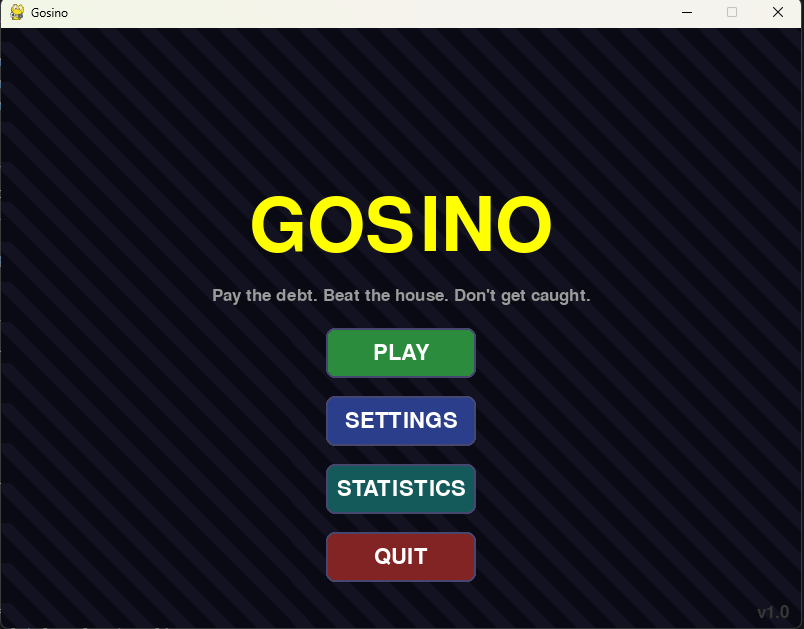
  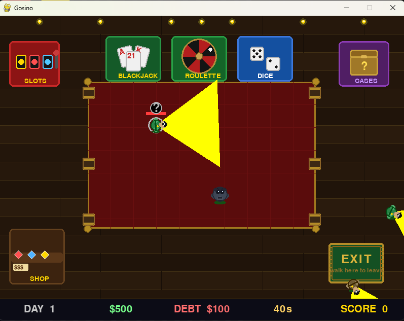
  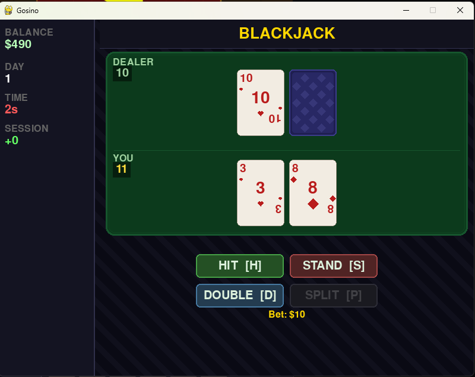
  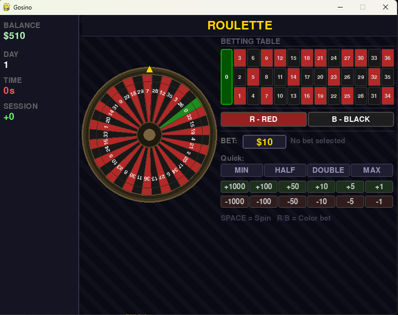
  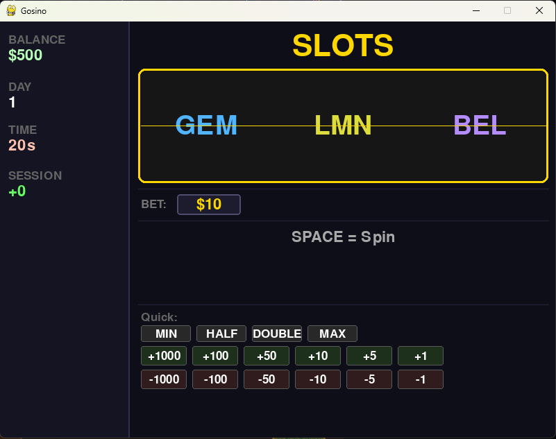
  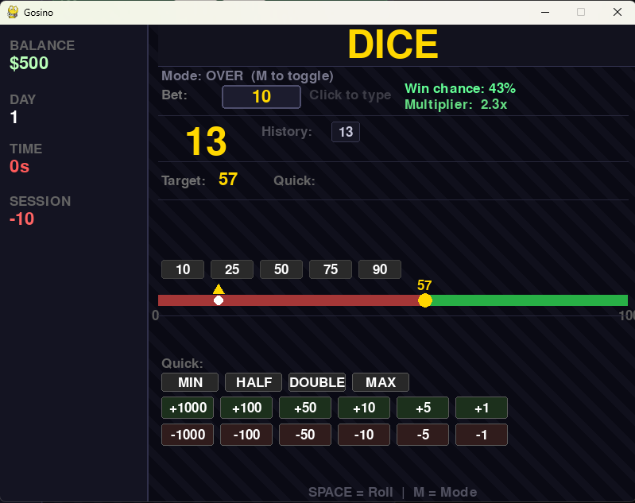
  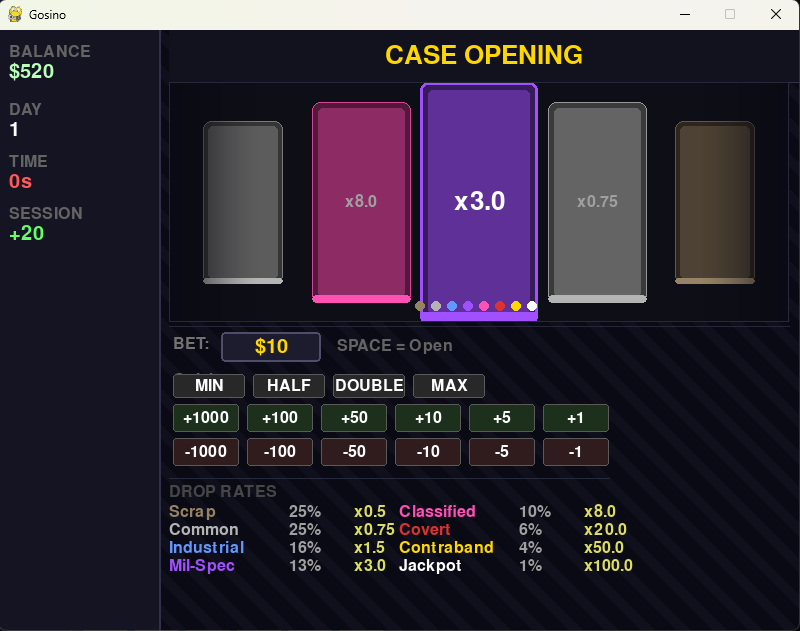
  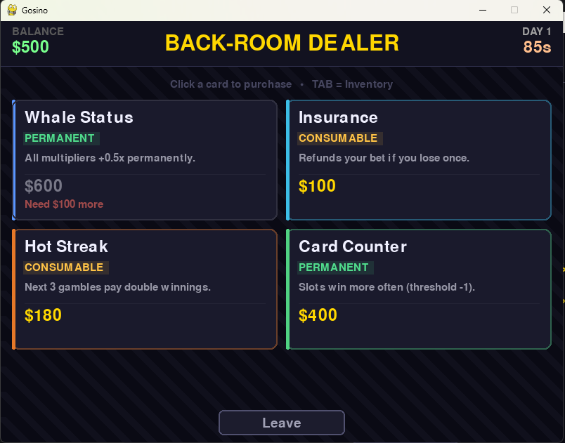
  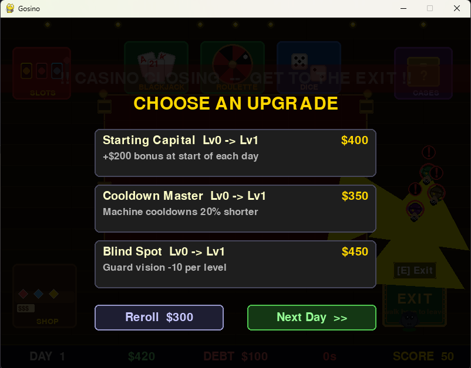
  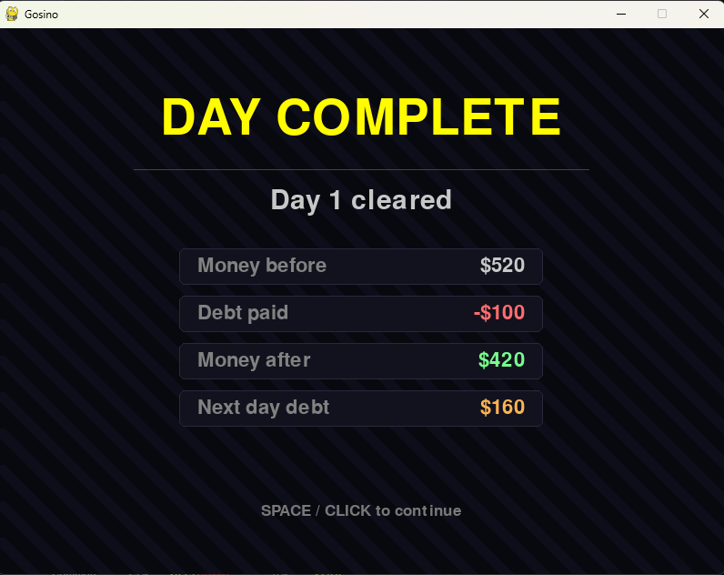
  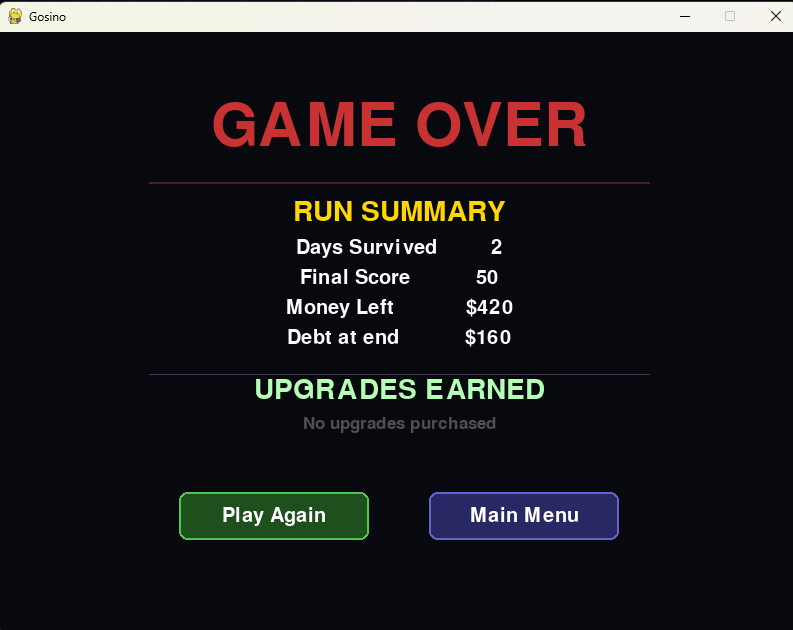
  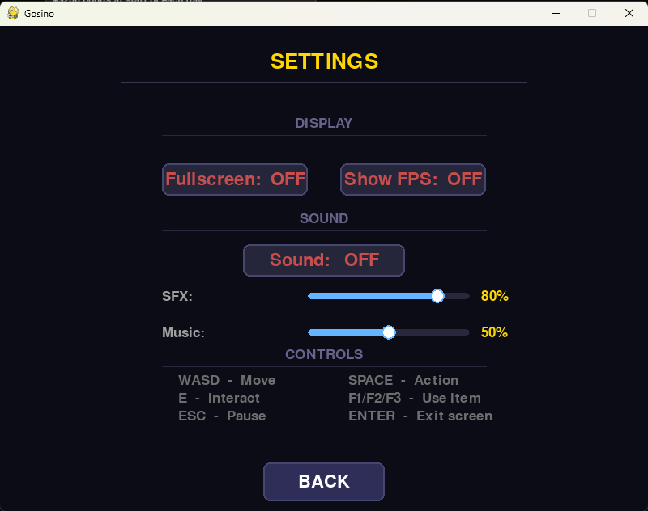

  ### Data Visualization
  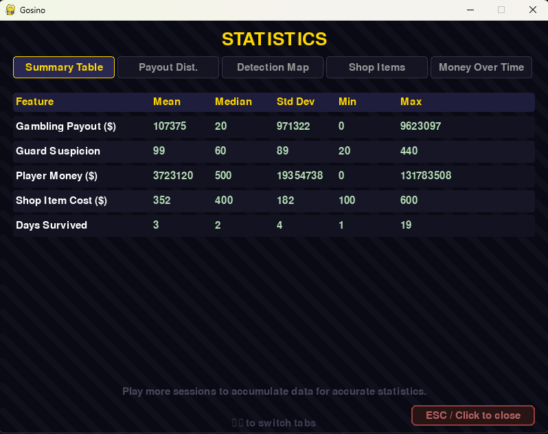
  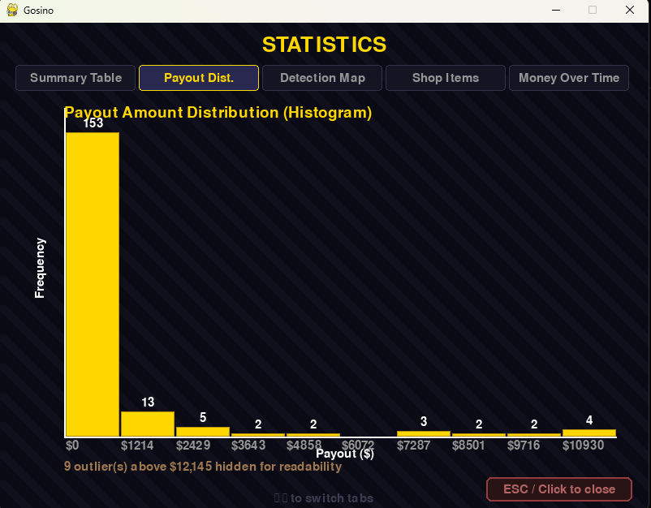
  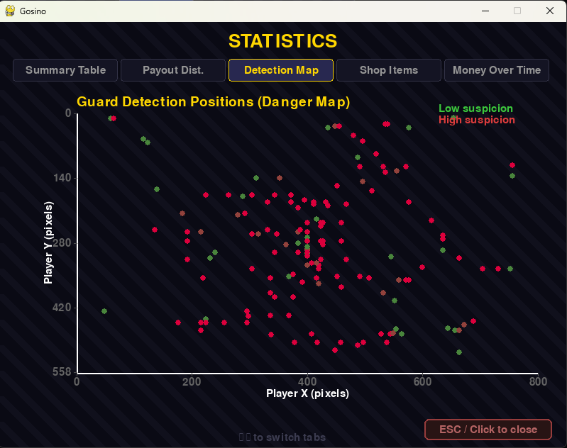
  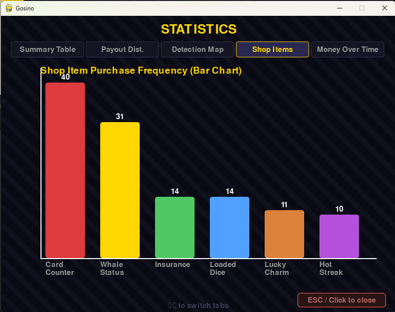
  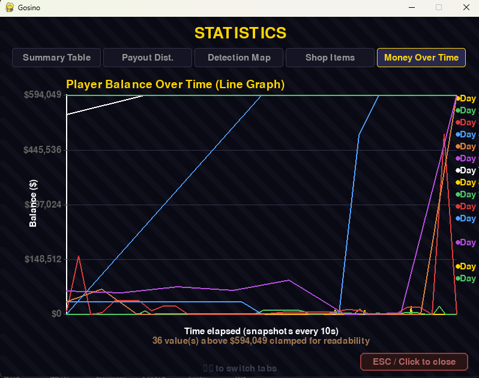

- **Proposal:** [Project Proposal](./proposal.pdf)

- **YouTube Presentation:** *https://youtu.be/4Ixf_HgF6ww*

---

## 2. Concept

### 2.1 Background

Gosino was created to explore what happens when two very different game genres — stealth and casino gambling — are combined into one experience. Casino games alone can feel passive, and stealth games alone can feel stressful. By combining them, every gambling decision now carries real tension: do you stay and play one more round to earn enough money, or do you run for the exit before the guard spots you?

The project was inspired by heist films where characters must stay calm under pressure while executing a plan in a hostile environment. The casino setting felt like a natural fit — high stakes, security, and the constant risk of being caught.

### 2.2 Objectives

- Build a complete and playable game loop with a clear win and lose condition
- Implement a guard AI system that feels reactive and fair to the player
- Create five distinct gambling mini-games each with their own mechanics and betting systems
- Design an escalating difficulty curve that keeps each run feeling fresh
- Record meaningful gameplay statistics and present them through clear in-game visualizations
- Deliver a polished user experience with sound, transitions, animations, and a consistent UI style

---

## 3. UML Class Diagram

The UML class diagram shows all major classes, their attributes, key methods, and relationships including association and dependency.

**Attachment:** [UML Class Diagram](./uml.pdf)

---

## 4. Object-Oriented Programming Implementation

- **`Game`** — Top-level controller in `main.py`. Owns the main game loop, manages all state transitions, routes events to the correct system, and coordinates all subsystems. Acts as the central hub connecting every other class.

- **`Player`** — Represents the player character. Handles WASD movement, wall and boundary collision, and stores all player attributes including money, speed, luck, stealth, and upgrade bonuses.

- **`Guard`** — Security guard AI. Implements patrol movement with smooth angle interpolation, vision cone detection, alert/chase/search state machine, wall collision with smart bounce, and closing-time forced chase behavior.

- **`CasinoMap`** — Manages the casino floor layout including wall definitions, interactive zone areas, and per-zone cooldown timers. Handles interaction zone detection for the player.

- **`DaySystem`** — Manages the day counter, countdown timer, debt amount, and closing state. Controls time limit reduction between days and debt escalation.

- **`DayTransition`** — Animated summary screen shown between days. Displays money before/after, debt paid, and next day's debt with staggered row animations and a glow effect.

- **`Shop`** — Full shop screen with a card-based UI. Manages stock rolling, purchase logic, inventory slot management, permanent upgrade application, and hover/feedback rendering.

- **`UpgradeManager`** — Manages the between-day upgrade selection. Rolls randomized upgrade choices from a pool, tracks owned upgrade levels, applies effects directly to the player, and handles reroll purchases.

- **`InventoryPanel`** — Fading overlay panel opened with TAB. Shows consumable slots, player stats, and owned upgrades with smooth alpha-based fade in/out animation.

- **`SlotMachine`** — Three-reel slot machine with pre-determined outcomes, animated spinning reels with ghost symbols, quick bet buttons, fine adjustment buttons, and flash feedback.

- **`Blackjack`** — Full casino-rules blackjack with split, double down, dealer soft-17 logic, animated card dealing, and multi-hand result display.

- **`Roulette`** — Animated spinning roulette wheel with ball physics simulation, 37-sector number grid betting table, red/black color bets, and result snapping.

- **`DiceGame`** — Over/Under dice game with a probability slider, animated counter roll, target quick-set buttons, and win chance/multiplier calculation.

- **`CaseOpening`** — CS:GO-inspired case opening with a scrolling reel of 8 weighted rarity tiers, perspective scaling animation, and edge fade effect.

- **`MessageSystem`** — Two-channel message system supporting floating world messages and fixed UI messages. Handles queuing, spawn delay, fade-out, and color-coded display.

- **`ScoreSystem`** — Tracks and displays the player's cumulative score earned from gambling wins.

- **`SuspicionSystem`** — Tracks the global suspicion level with increase/decrease methods and a drawn suspicion bar.

- **`SoundManager`** — Manages all audio including pre-loaded SFX and music tracks. Supports non-blocking music switching with fade in/out, separate SFX and music volume channels, mute toggle, and footstep timing.

- **`TitleScreen`** — Title and settings screen with animated background, button navigation, fullscreen toggle, FPS toggle, sound toggle, and dual volume sliders with drag support.

- **`StatsLogger`** — Records gameplay data to five CSV files (gambling, detection, money, shop, day_summary). Handles session counters, 10-second money snapshots, and append-mode file writing across sessions.

- **`StatsScreen`** — In-game statistics viewer with five tabbed visualizations drawn entirely with Pygame primitives: summary table, payout histogram, detection scatter plot, shop bar chart, and money line graph.

- **`Clothing`** — Data class representing a clothing item with name, cost, suspicion reduction, and durability tracking.

---

## 5. Statistical Data

### 5.1 Data Recording Method

All gameplay data is recorded by the `StatsLogger` class and saved to CSV files inside a `stats/` folder. Files are opened in append mode so data accumulates across multiple sessions without overwriting previous runs. Each row includes a timestamp so data from different sessions can be identified. The logger is updated every frame for time-based snapshots and called directly by game systems when discrete events occur (a gamble resolves, a guard detects the player, a shop purchase is made).

### 5.2 Data Features

| CSV File | What It Records | Key Columns |
|---|---|---|
| `gambling.csv` | Every gambling event | game_type, bet_amount, payout, outcome, shop_effect_used |
| `detection.csv` | Guard detection events | suspicion_level, player_x, player_y, guard_type, guard_state |
| `money.csv` | Player balance snapshots every 10s | player_money, debt, net_balance, day |
| `shop.csv` | Every shop purchase | item_name, item_type, item_cost, player_money_after |
| `day_summary.csv` | End-of-day summary | time_used, starting_money, ending_money, total_wins, total_losses, guards_triggered |

These five features were chosen because they cover the four core systems of the game — gambling performance, guard evasion, economy management, and shopping strategy — giving a complete picture of how a player approaches each run.

---

## 6. Changed Proposed Features

- **Case Opening mini-game** was added beyond the original proposal as an additional gambling option inspired by CS:GO-style loot cases, using a weighted rarity tier system with 8 tiers.
- **In-game statistics viewer** (`StatsScreen`) was added as an in-game visualization tool so players can view their data without leaving the game, in addition to the standalone `analysis.py` script.
- **Day Transition screen** was added to provide a clear summary between days, which was not in the original proposal but significantly improves game feel.

---

## 7. External Sources

- **music_casino.ogg(Casino Man)** — https://opengameart.org/content/casino-man - Music
- **music_chase(Free-Jazz/Bebop Chase Music)** — https://opengameart.org/content/free-jazzbebop-chase-music - Music
- **music_victory(On my way)** — https://opengameart.org/ - Music
- **alert.WAV, buy.wav, card_deal.wav, chip.wav, day_complete.wav, exit_zone.wav, footstep.wav, game_over.wav, lose.wav, spin.wav, win.wav** — https://opengameart.org/ - sfx